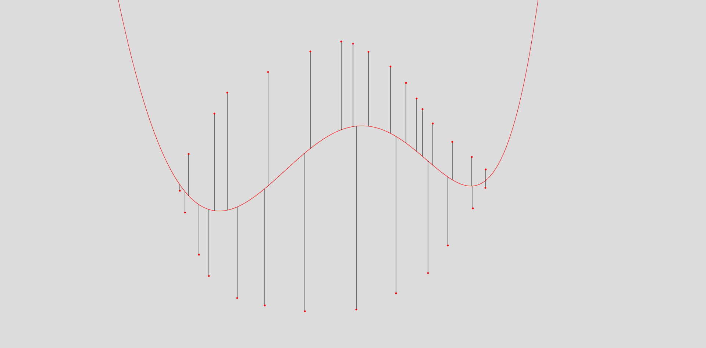
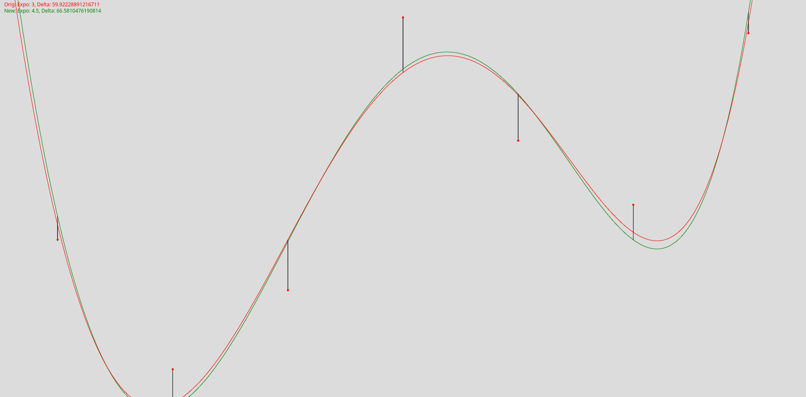

# Description
The project consists of the main `regression.lib.ts` library and two applications of the library. One application creates a regression based on points from mouse input. The second application finds the best exponent for calculating the delta between the regression's function and the given points.
The project uses the following library: https://github.com/processing/p5.js.

# Some screenshots




# Installation

0. You probably need a `typescript` compiler and you will need `wget` if you
   want to download [p5.js](https://p5js.org/download/) with the terminal. Here
   is the command for Arch Linux.

```bash
sudo pacman -S wget typescript
```

Alternatively, you can download [p5.js](https://p5js.org/download/) with a
browser of your choice and use any other compiler.

1. Clone the repository

```bash
git clone https://github.com/LetzteFee/polynome-regression.git
cd polynome-regression
```

2. Download the [p5.js library](https://p5js.org/download/) into the `src`
   folder.

```bash
wget -O src/p5.js https://github.com/processing/p5.js/releases/download/v1.6.0/p5.js
```

3. Compile the typescript to javascript

```bash
tsc
```

4. Finally open `src/index.html` with a web browser like firefox.

```bash
firefox src/index.html
```
