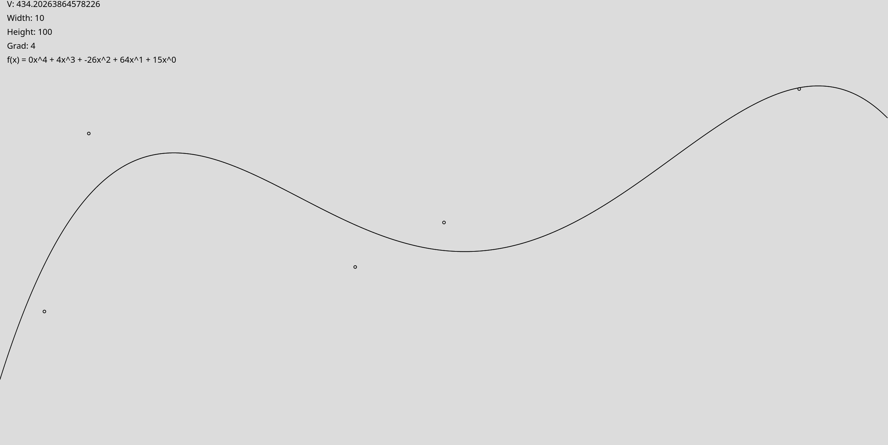

 Used Library: https://github.com/processing/p5.js

# Installation

Download the [p5.js library](https://p5js.org/download/) into the `src` folder.
Then run the `tsc` command in your terminal and finally open `src/index.html`
with a web browser like firefox.

```bash
git clone https://github.com/LetzteFee/polynome-regression.git
cd polynome-regression
wget -O src/p5.js https://github.com/processing/p5.js/releases/download/v1.6.0/p5.js
tsc
firefox src/index.html
```
